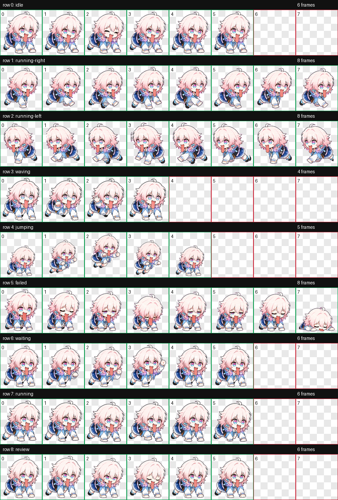

# March 7th Codex Pet

一个用于 Codex 的三月七同人小宠物。它包含完整的 9 行 Codex 宠物动画图集、安装用 `pet.json`、联系表和逐状态 GIF 预览。

> 非官方同人项目。本项目与 HoYoverse、米哈游或《崩坏：星穹铁道》没有关联。March 7th / 三月七与 Honkai: Star Rail / 崩坏：星穹铁道相关权利归其各自权利方所有。

## 预览



招手预览：


## 安装

将 `pet/` 目录复制到 Codex 宠物目录：

```bash
mkdir -p ~/.codex/pets/march-7th-tongue
cp pet/pet.json ~/.codex/pets/march-7th-tongue/pet.json
cp pet/spritesheet.webp ~/.codex/pets/march-7th-tongue/spritesheet.webp
```

也可以直接运行：

```bash
./install.sh
```

安装后重启 Codex 或重新加载宠物列表。

## 让 AI 自动添加宠物

如果你正在使用 Codex，可以让 AI 直接帮你安装。把这个仓库打开为当前工作目录，然后发送：

```text
请帮我安装这个 Codex 小宠物。将 pet/pet.json 和 pet/spritesheet.webp 复制到 ${CODEX_HOME:-$HOME/.codex}/pets/march-7th-tongue/，如果目录不存在就创建它。安装后请检查目标目录里两个文件都存在。
```

AI 应执行的动作等价于：

```bash
mkdir -p "${CODEX_HOME:-$HOME/.codex}/pets/march-7th-tongue"
cp pet/pet.json "${CODEX_HOME:-$HOME/.codex}/pets/march-7th-tongue/pet.json"
cp pet/spritesheet.webp "${CODEX_HOME:-$HOME/.codex}/pets/march-7th-tongue/spritesheet.webp"
ls -la "${CODEX_HOME:-$HOME/.codex}/pets/march-7th-tongue"
```

安装完成后，重启 Codex 或重新加载宠物列表。

## 文件

- `pet/pet.json`: Codex 宠物清单。
- `pet/spritesheet.webp`: `1536x1872` RGBA 动画图集，单元尺寸 `192x208`。
- `contact-sheet.png`: 全状态联系表。
- `previews/*.gif`: 各状态动画预览。

## 状态行

| 行 | 状态 | 帧数 | 含义 |
| --- | --- | ---: | --- |
| 0 | `idle` | 6 | 待机 |
| 1 | `running-right` | 8 | 向右拖动 |
| 2 | `running-left` | 8 | 向左拖动 |
| 3 | `waving` | 4 | 招手 |
| 4 | `jumping` | 5 | 跳跃 |
| 5 | `failed` | 8 | 失败或中断 |
| 6 | `waiting` | 6 | 等待用户输入 |
| 7 | `running` | 6 | 执行任务中 |
| 8 | `review` | 6 | 查看结果 |

## 质量记录

- 图集尺寸：`1536x1872`
- 格式：RGBA WebP
- 透明像素残留：0
- 已修复 `waving` 行第 2 帧的多手问题

## 许可与权利

仓库中的安装脚本和文档使用 MIT License，见 [LICENSE-CODE](./LICENSE-CODE)。

生成的同人宠物素材见 [LICENSE-ASSETS](./LICENSE-ASSETS) 与 [NOTICE](./NOTICE)。由于角色来源于已有作品，本仓库不能授予任何关于原角色、作品名称或商标的权利。
